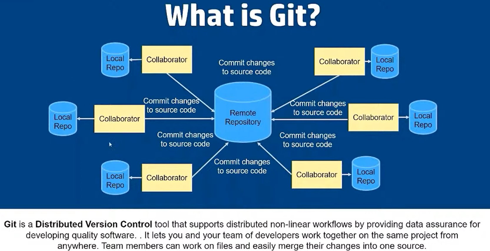

# Git Notes
* What is version control?
	* 2 developers working on same code base. Writes code for different features. We need system that can track all the changes done by all developers on all files
	* Version control is a system that records changes to file/files over time so that we can recall specific versions later
	* versions can be recorded in repository
	* there are `Local`, `Centralized`, `Distributed` version control systems
* Why version control system?
	* collaboration
		* shared workspace
		* realtime updates
	* manage versions
	* rollbacks
	* reduced down time
	* project analysis
* What is repository
	* centralized directory to allow any developer to submit the code
	* we can keep code files, images, text files inside repository
	* Example online repositories
		* Github
		* Bitbucket
		* Gitlab
	
## Revert specific commit
* There are a couple of ways to `undo` commits in Git. The `reset` command, for example, allows you to restore your project at any previous revision - effectively `undoing` all the commits that came afterwards
* A different situation, however, is when you want to undo the effects of only a certain commit - and not discard any commits that came after that one. This is a classic scenario for the `revert` command
* Using the revert command doesn't delete any commits. Quite the contrary: it creates a new revision that reverts the effects of a specified commit
* Just use the `revert` command and provide the commit you want to `undo`
```
git revert 0ad5a7a6
```

## Git vs Github vs Gitlab
* Git
	* Version control system
	* Allows us to track changes
	* Maintains hystorical backup like snapshots
	* Allows team based development. Allow teams to work on same codebase simultaneously
	* Flexible. Can work local, devops etc
	* CLI
	* Trunk based development
		* master branch as main branch/trunk
		* we can create as many branches as needed and work
	* We have repo
		* Place where we have our code
* Github and Gitlab
	* Hosted Git in cloud
	* Web based
	* Open source
	* Bug tracker available
* Reference
	* Youtube - https://www.youtube.com/watch?reload=9&v=wpISo9TNjfU&ab_channel=IBMCloud

