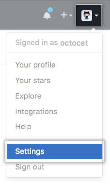
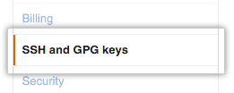
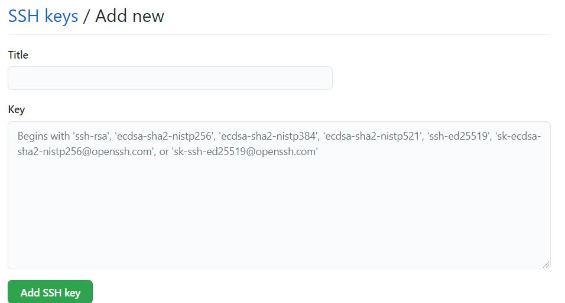
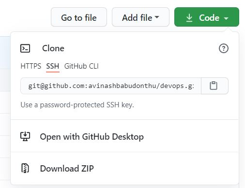

# Connect to github repository using SSH key
* Open Gitbash
* Create new ssh key
```
ssh-keygen -t rsa -b 4096 -C "email-id@example.com"
```
* Add your github email address in the above command.
* This creates a new ssh key, using the provided email as a label.
```
Enter a file in which to save the key (/home/you/.ssh/id_rsa): [Press enter]
```
* Press enter to proceed
* Enter a password when prompted. This password will be required for authenticating once you logged in. You can ignore if dont want to enter passphrase on every push
* Now your ssh key will get generated. You have to add the public key to your github account.
* Check public key
```
cat ~/.ssh/id_rsa.pub
```
* Copy the content
* Open Github account and go to settings page

* On the side bar, click `SSH and GPG keys`

* Click `New SSH key` button

* Enter `Title`, above copied public key

* Click `Add SSH key` button
* If prompted, confirm your GitHub password
* After you’ve set up your SSH key and added it to your GitHub account, you can test your connection
```
ssh -T git@github.com
```
* Enter passphrase if prompted
* We may see message like below
```
Hi username! You've successfully authenticated, but GitHub does not provide shell access.
```
* Congratulations, now you can use your connect to your github account using the ssh key !!!
* Now you can clone your github repository using ssh command.
* In github, copy the ssh clone link for a repository.

* Open terminal and go to the folder where you want to clone the repository. Then clone the repository using the clone command as below
```
git clone git@github.com:avinashbabudonthu/devops.git
```
* Now you can do git operations like push, pull, fetch etc without prompting for your username and password.
* Note : If you restart your system, when you try to do any git operation, it will prompt for your passphrase for first time. Enter the passphrase to continue. You can save the password permanently to avoid asking for passphrase every time you log on the system.
* If you have already a local repository, you have to run one more line of code to link your ssh key with the local repository.
```
git remote set-url origin git@github.com:git/git.git
```